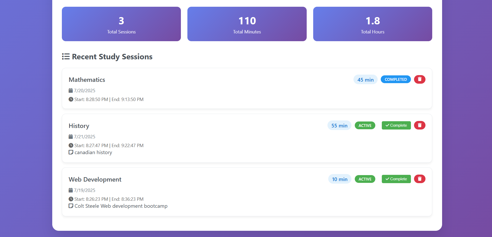

# Study Session Logger

A beautiful and modern web application to track and analyze your study sessions. Built with Express.js, Node.js, EJS templating, and JavaScript.

## Features

- 🔐 **User Authentication**: Secure login and registration system
- ⏱️ **Study Timer**: Built-in countdown timer with start/stop functionality
- 🔔 **Session Notifications**: Desktop notifications when study sessions end
- 📝 **Log Study Sessions**: Add study sessions with subject, duration, date, and optional notes
- 📊 **Visual Statistics**: View detailed analytics with interactive charts
- 🎨 **Modern UI**: Beautiful, responsive design with gradient backgrounds and smooth animations
- 📱 **Mobile Friendly**: Optimized for all device sizes
- 🗑️ **Session Management**: Delete individual study sessions and mark them as completed
- 📈 **Progress Tracking**: Monitor your learning progress over time
- ⏰ **Start/End Times**: Track exact start and end times for each session


### Login Page
- Secure authentication with username and password
- User registration functionality
- Modern, clean design




### Home Page
- Interactive study timer with countdown
- Add new study sessions with a clean form
- View recent sessions with status indicators
- Quick statistics overview
- Responsive design for all devices


### Statistics Page
- Interactive doughnut chart showing study time by subject
- Detailed subject breakdown with session counts and averages
- Recent sessions list
- Comprehensive analytics

## Installation

1. **Clone or download the project**
   ```bash
   git clone <https://github.com/DevOlabode/study-session-logger>
   cd study-session-logger
   ```

2. **Install dependencies**
   ```bash
   npm install
   ```

3. **Start the application**
   ```bash
   npm start
   # or for development with auto-restart:
   npm run dev
   ```

4. **Open your browser**
   Navigate to `http://localhost:3000`

5. **Default Login**
   - Username: `admin`
   - Password: `admin123`

## Usage

### Authentication
1. **Login**: Use the default credentials or register a new account
2. **Register**: Create a new account with username and password
3. **Logout**: Click the logout button to securely end your session

### Using the Study Timer
1. **Start Timer**: Click "Start Session" to begin timing your study session
2. **Monitor Progress**: Watch the countdown timer in real-time
3. **Stop Timer**: Click "Stop Session" to end the timer
4. **Save Session**: The timer data will be automatically included when you save a session

### Adding a Study Session
1. Fill out the form on the home page:
   - **Subject**: Enter the subject you studied (e.g., Mathematics, Physics)
   - **Duration**: Enter the study time in minutes
   - **Date**: Select the date (defaults to today)
   - **Notes**: Optional notes about what you studied
2. Click "Save Session" to add it to your log
3. The session will be marked as "active" and you can complete it later

### Managing Sessions
- **Complete Session**: Click the "Complete" button to mark a session as finished
- **Delete Session**: Click the trash icon to delete a session
- **View Details**: See start/end times and session status

### Viewing Statistics
1. Click on "Statistics" in the navigation
2. View your study analytics including:
   - Total sessions and time
   - Study time breakdown by subject
   - Average session duration per subject
   - Recent session history

## Technology Stack

- **Backend**: Node.js with Express.js
- **Authentication**: Express-session with bcrypt password hashing
- **Template Engine**: EJS (Embedded JavaScript)
- **Frontend**: HTML5, CSS3, JavaScript (ES6+)
- **Styling**: Custom CSS with modern design patterns
- **Charts**: Chart.js for data visualization
- **Icons**: Font Awesome for beautiful icons
- **Data Storage**: JSON file-based storage
- **Notifications**: Node-notifier for desktop notifications

## Project Structure

```
study-session-logger/
├── app.js                 # Main Express server file
├── package.json           # Node.js dependencies and scripts
├── README.md             # Project documentation
├── views/                # EJS template files
│   ├── index.ejs         # Home page template
│   ├── stats.ejs         # Statistics page template
│   ├── login.ejs         # Login page template
│   └── register.ejs      # Registration page template
├── public/               # Static assets
│   ├── css/              # Stylesheets
│   └── favicon.ico       # Favicon for notifications
└── data/                 # Data storage directory
    ├── sessions.json     # Study sessions data file
    └── users.json        # User authentication data
```

## API Endpoints

- `GET /login` - Login page
- `POST /login` - Authenticate user
- `GET /register` - Registration page
- `POST /register` - Create new user account
- `GET /logout` - Logout user
- `GET /` - Home page with session form and list (requires auth)
- `POST /session` - Add a new study session (requires auth)
- `POST /session/:id/complete` - Mark session as completed (requires auth)
- `DELETE /session/:id` - Delete a specific session (requires auth)
- `GET /stats` - Statistics page with analytics (requires auth)

## Data Structure

### Study Sessions
```json
{
  "id": "unique-timestamp-id",
  "subject": "Subject name",
  "duration": 30,
  "notes": "Optional notes",
  "date": "2024-01-15",
  "startTime": "2024-01-15T10:30:00.000Z",
  "endTime": "2024-01-15T11:00:00.000Z",
  "timestamp": "2024-01-15T10:30:00.000Z",
  "username": "user123",
  "status": "active"
}
```

### Users
```json
{
  "username": "user123",
  "password": "hashed-password",
  "createdAt": "2024-01-15T10:30:00.000Z"
}
```

## Features in Detail

### Authentication System
- Secure password hashing with bcrypt
- Session-based authentication
- User registration and login
- Protected routes

### Study Timer
- Real-time countdown display
- Start/stop functionality
- Automatic session timing
- Integration with session logging

### Notifications
- Desktop notifications when sessions end
- Browser notification support
- Custom notification messages
- Sound alerts

### Session Management
- Active and completed session status
- Start and end time tracking
- Session completion workflow
- User-specific sessions

## Customization

### Adding New Features
- The modular structure makes it easy to add new features
- Routes are organized in `app.js`
- Templates are in the `views/` directory
- Styling can be customized in the CSS sections of each template

### Styling
- The app uses a modern gradient design
- Colors can be easily modified in the CSS
- Responsive design ensures it works on all devices

## Security Notes

- Change the session secret in production
- Use HTTPS in production environments
- Consider using a proper database for user data
- Implement rate limiting for login attempts

## Contributing

1. Fork the repository
2. Create a feature branch
3. Make your changes
4. Test thoroughly
5. Submit a pull request

## License

This project is open source and available under the [MIT License](LICENSE).

## Future Enhancements

- [ ] Export data to CSV/PDF
- [ ] Study goals and targets
- [ ] Study streak tracking
- [ ] Study reminders and scheduling
- [ ] Dark mode toggle
- [ ] Data backup/restore
- [ ] Study session templates
- [ ] Progress sharing
- [ ] Study group features

## Support

If you encounter any issues or have questions, please open an issue on the repository or contact the maintainers.

---

**Happy Studying! 📚✨** 
